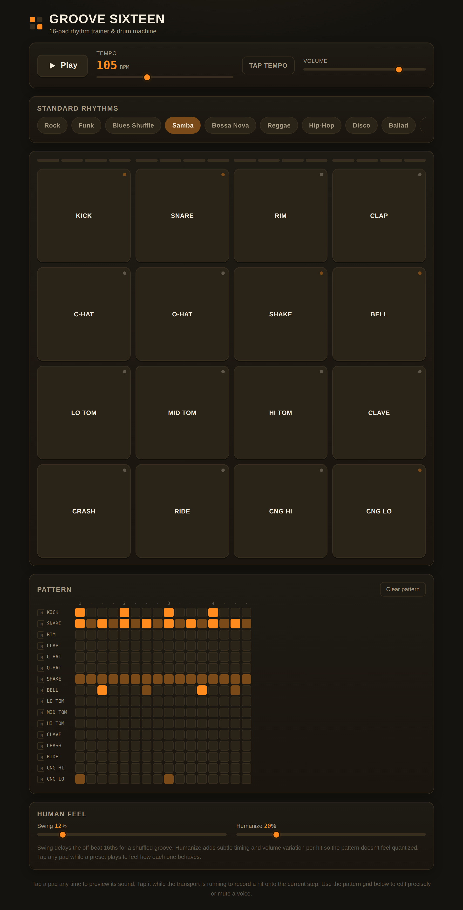

# Groove Sixteen

A 16-pad rhythm trainer and drum machine that runs entirely in the browser — no build step, no dependencies, no sample files. Every drum sound is synthesized live with the Web Audio API.



## Features

- **16 synthesized voices** — kick, snare, rim, clap, closed/open hi-hat, shaker, cowbell, low/mid/hi tom, clave, crash, ride, and hi/lo conga, laid out as a 4×4 pad grid. Tap a pad any time to preview its sound.
- **9 built-in grooves** — Rock, Funk, Blues Shuffle, Samba, Bossa Nova, Reggae, Hip-Hop, Disco, and Ballad, each with its own tempo, swing, and multi-instrument pattern.
- **Tap-to-record** — tap a pad while the transport is running and it records a hit onto the current step, so you can build a pattern by feel.
- **Precision pattern editor** — a 16-instrument × 16-step grid below the pads for editing hits directly, muting individual voices, and seeing the whole arrangement at once.
- **Swing & Humanize controls** — swing delays the off-beat 16th notes for a shuffled feel; humanize adds subtle randomized timing and velocity per hit so a looped pattern doesn't sound quantized.
- **Tap tempo** — tap the tempo button a few times to set the BPM by feel.
- **Works offline** — a single self-contained HTML file. Your pattern, tempo, and mixer settings are saved to `localStorage` so they're there next time you open it.

## Getting started

No installation required.

1. Download `index.html` from this repo.
2. Open it in any modern browser (Chrome, Safari, Firefox, Edge).

That's it — the app boots straight into a Rock pattern, ready to play.

### Hosting it with GitHub Pages

Because it's a single static HTML file, you can serve it straight from this repo:

1. Push `index.html` to the repo's default branch.
2. In **Settings → Pages**, set the source to that branch (root folder).
3. GitHub will publish it at `https://<your-username>.github.io/<repo-name>/`.

## How it works

- **Audio engine** — every voice (kick, snare, hats, toms, cymbals, percussion) is built from oscillators, filtered noise bursts, and short gain envelopes via the Web Audio API. Nothing is streamed or decoded from a file, so playback starts instantly and there's nothing to download.
- **Scheduler** — playback uses the standard Web Audio look-ahead scheduling pattern: a `setTimeout` loop queues upcoming hits against `AudioContext.currentTime` a fraction of a second ahead, which keeps timing sample-accurate regardless of JavaScript's own timer jitter.
- **Swing** — delays every other 16th-note step by a percentage of a step's duration.
- **Humanize** — applies small random offsets to each hit's timing and volume, scaled by the Humanize slider, so patterns feel played rather than programmed.

## Browser support

Requires the Web Audio API (`AudioContext`), which is supported in all current versions of Chrome, Safari, Firefox, and Edge. No mobile app or plugin needed — it also works on iOS/Android browsers, though audio playback on phones requires a tap to start (a browser autoplay restriction, not a bug).

## Project structure

```
.
├── index.html              # the entire app — markup, styles, and JavaScript
├── README.md
└── screenshots/
    └── screenshot.png
```

## License

No license is currently attached to this project. If you plan to share or accept contributions, consider adding a `LICENSE` file — [MIT](https://choosealicense.com/licenses/mit/) is a common, permissive choice for a small project like this.

## Credits

Built with [Claude](https://claude.com).
